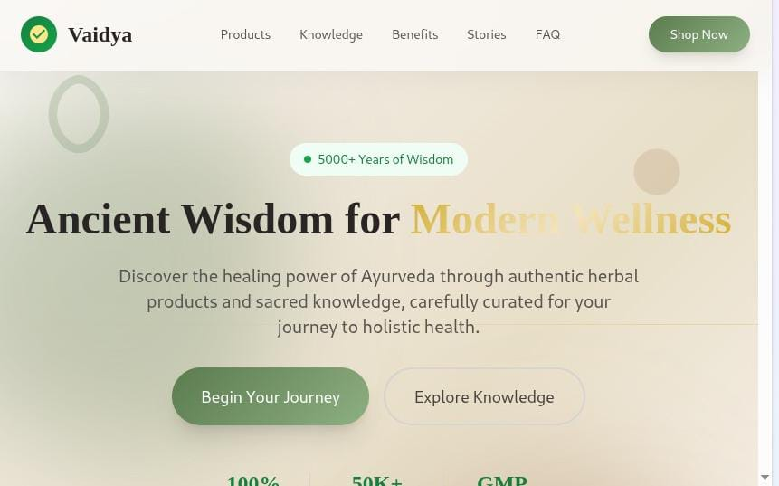
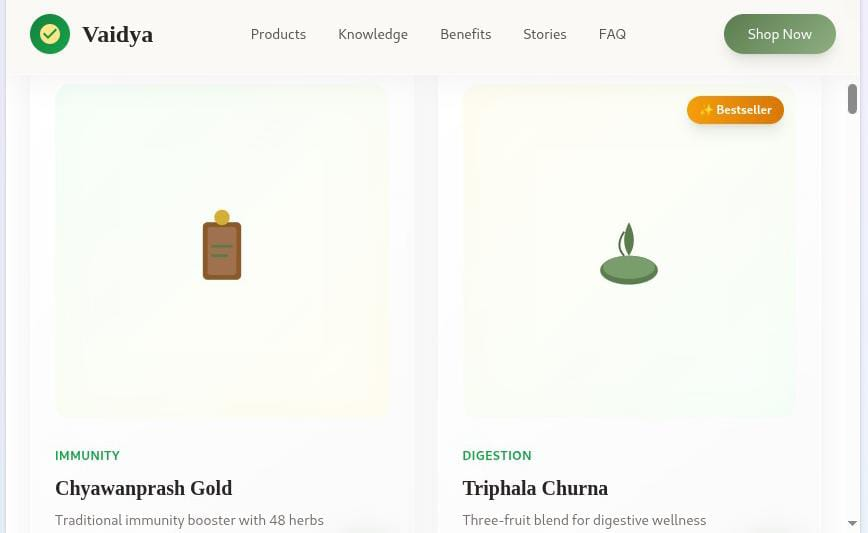
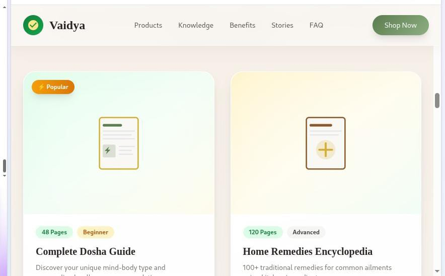
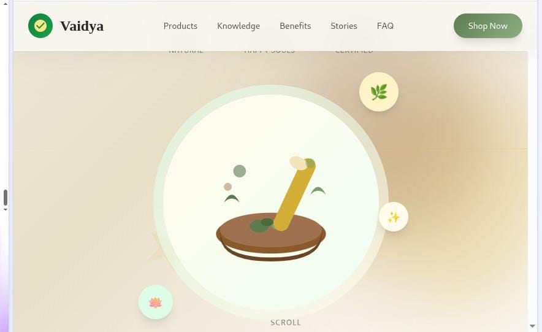
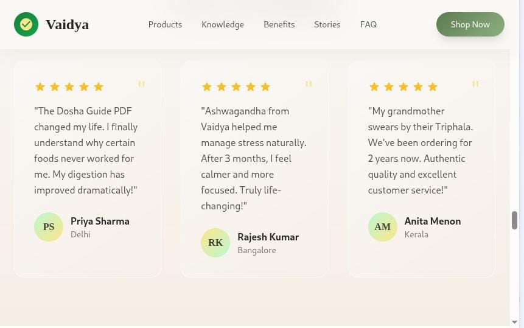

# 🌿 Vaidya — Ayurvedic Wellness Website (Frontend)

A premium **frontend-only Ayurvedic wellness website** designed to blend  
**ancient Indian healing wisdom** with a **modern, calm, and user-friendly interface**.

This project focuses purely on **UI/UX, visual storytelling, and smooth interactions**.  
Backend, payments, and downloads can be integrated later as per business needs.

---

## ✨ Highlights

- 🌿 Modern Ayurveda-inspired design
- 🎨 Calm, earthy color palette
- 🧠 Knowledge Library UI (Paid PDF concept)
- 🛍️ Product showcase UI
- 📱 Fully responsive layout
- 🎥 Smooth animations & micro-interactions
- 🧭 Clean and intuitive navigation
- 📖 Story-driven sections (Benefits, Testimonials, FAQ)
- ⚡ Fast and lightweight frontend

---

## 🎯 Project Purpose

This frontend is designed for:
- Ayurvedic brands
- Wellness startups
- Digital knowledge sellers
- Health & lifestyle businesses

It visually supports a **“Pay → Instant PDF Download”** flow  
**without implementing backend logic**, keeping the frontend clean and flexible.

---

## 🧭 Website Sections

- Hero (Brand story & call-to-action)
- Ayurvedic Products (UI cards)
- Knowledge Library (PDF UI)
- How It Works (visual flow)
- Benefits of Ayurveda
- Testimonials
- FAQ
- Contact & Footer

---

## 🎨 Design Philosophy

- **Ancient wisdom, modern presentation**
- Minimal but premium visuals
- Comfortable typography for all age groups
- Trust-focused layout
- Wellness-first user experience

---

## 🛠️ Tech Stack (Frontend Only)

- HTML5
- Tailwind CSS
- Vanilla JavaScript
- Google Fonts  
  - Cormorant Garamond (Headings)  
  - DM Sans (Body)

No frameworks. No backend. No build tools.

---

## 📸 Screenshots

> Screenshots are stored in the `screenshots` folder

### 🏠 Home


### 🌿 Products


### 📚 Knowledge Library


### 🔁 How It Works


### 💬 Testimonials & FAQ


---

---

## 🚀 How to Use

1. Clone the repository
   ```bash
   git clone https://github.com/your-username/vaidya-ayurveda-frontend.git


